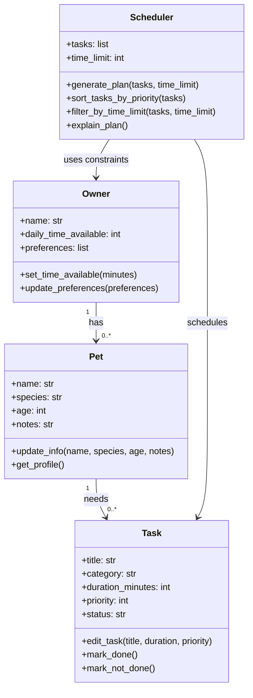

# PawPal+ Class Diagram

```mermaid
classDiagram
    class Owner {
      +name: str
      +daily_time_available: int
      +preferences: list
      +set_time_available(minutes)
      +update_preferences(preferences)
    }

    class Pet {
      +name: str
      +species: str
      +age: int
      +notes: str
      +update_info(name, species, age, notes)
      +get_profile()
    }

    class Task {
      +title: str
      +category: str
      +duration_minutes: int
      +priority: int
      +status: str
      +edit_task(title, duration, priority)
      +mark_done()
      +mark_not_done()
    }

    class Scheduler {
      +tasks: list
      +time_limit: int
      +generate_plan(tasks, time_limit)
      +sort_tasks_by_priority(tasks)
      +filter_by_time_limit(tasks, time_limit)
      +explain_plan()
    }

    Owner "1" --> "0..*" Pet : has
    Pet "1" --> "0..*" Task : needs
    Scheduler --> Owner : uses constraints
    Scheduler --> Task : schedules
```
